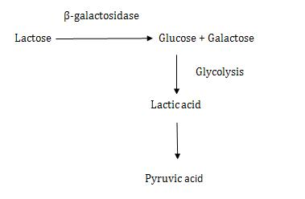
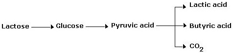
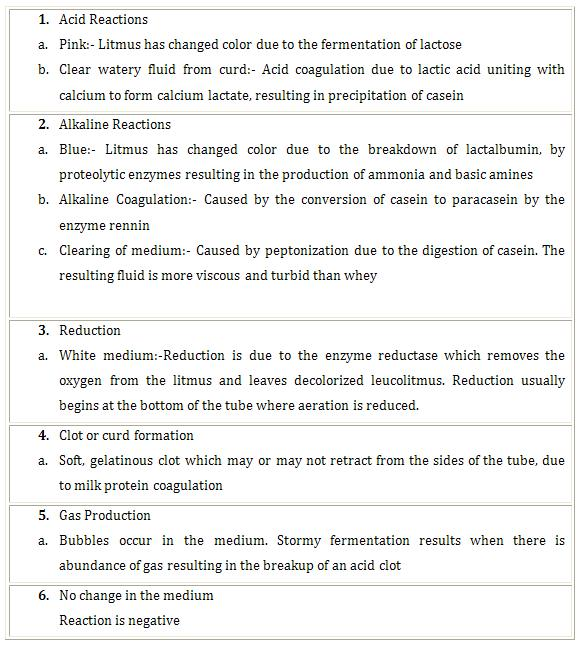

### Principle:
 

Milk is an excellent medium for the growth of microorganisms because it contains the milk protein casein, the milk sugar lactose, vitamins, minerals and water. Litmus, a pH indicator is incorporated in the medium for the detection of  production of acid or alkali and oxidation-reduction activities. A variety of different chemical changes occur in milk, depending upon which milk ingredients are utilized by the bacteria and is dependent upon the types of enzymes that the organism is able to produce.

 
&nbsp;

 

Litmus milk medium consists of 10% powdered skim milk and the dye molecule litmus. Litmus, upon addition to rehydrated skim milk, changes the colloidal milk suspension from white to lavender (pale bluish purple). Characteristic reactions observed with litmus milk are:
 
&nbsp;

1. Lactose Fermentation
2. Alkaline reaction
3. Curd Formation (acid curd and rennin curd)
4. Litmus reduction
5. Proteolysis (Peptonization)
6. Gas formation
7. Acid Production

 
&nbsp;

#### 1.   Lactose Fermentation:
 

Organisms capable of using lactose as a carbon source for energy production utilize the inducible enzyme β-galactosidase and degrade lactose as follows

The presence of lactic acid is easily detected because litmus is purple at a neutral pH and turns pink when the medium is acidified to an appropriate pH of 4.
 
&nbsp;

#### 2.  Alkaline Reaction:
 

An alkaline reaction is evident when the colour of the medium remains unchanged or changes to a deeper blue. This reaction is indicative of the partial degradation of casein into shorter polypeptide chains, with the simultaneous release of alkaline end products that are responsible for the observable color change.

 
 
&nbsp;

#### 3.  Curd Formation:
 

The biochemical activities of different microorganisms grown in litmus milk may result in the production of two distinct types of curds(Clots). Curds are designated as either acid or rennet, depending on the biochemical mechanisms responsible for their formation.

 

Acid curd:-Lactic acid or other organic acid accumulation cause precipitation of the milk protein casein as calcium caesinate to form an insoluble clot. The clot is too hard and will not  get retract from the walls of the test tube. An acid curd is easily identified if the tube is inverted and the clot remains immobile.

 

Rennet curd:-Some organisms produce rennin, an enzyme that acts on casein to form paracasein, which in the presence of calcium ions is converted to calcium paracaseinate and forms an insoluble clot. Unlike the acid curd, this is a soft semi solid clot that will flow slowly when the tube is tilted.
Acid or rennet curds are quite palatable dairy products known as “ Cottage Cheese”.

 
 
&nbsp;

#### 4.  Litmus Reduction:
 

Fermentation is  an anaerobic process involving biooxidations that occur in the absence of molecular oxygen. These  oxidations may be visualized as the removal of hydrogen ( dehydrogenation) from a substrate. Since hydrogen ions cannot exist in the free state, there must be an immediate electron acceptor available to bind these hydrogen ions, or else oxidation–reduction reactions are not possible and cells cannot manufacture energy. In the litmus milk test,  litmus acts as such an acceptor. While in the oxidized state, the litmus is purple; when it accepts hydrogen from a substrate, it will become reduced and turn white or milk colored. This oxidation of lactose, which produces lactic acid, butyric acid, CO2 and H2  is as follows:

 
  
&nbsp;

 The excess hydrogen is now accepted by the hydrogen acceptor litmus, which turns white and is said to be reduced.

  
&nbsp;

#### 5.  Proteolysis (Peptonization):
 

The inability of some microorganisms to obtain their energy by way of lactose fermentation uses other nutritional sources such as proteins for this purpose. By means of proteolytic enzymes, these organisms hydrolyze the  milk proteins, primarily casein, into their basic building blocks, namely amino acids. This digestion of proteins is accompanied by the evolution of large quantities of ammonia, resulting in an alkaline pH in the medium with foul smell. The litmus turns deep purple. With further incubation of the medium, an opaque clearing of the medium occurs as the casein is hydrolyzed to peptides and amino acids. The opaque, turbid liquid supernatant (whey like appearance) turns brown in colour.

 
 
&nbsp;

#### 6.  Gas Formation:
 

Some bacteria(eg: Clostridia) ferment lactose of milk with the production of acid and gases like CO2 and H2. Gas production is detected by bubbles in the acid curd or by the development of tracks or fissures within the curd as gas rises to the surface.

 
 
&nbsp;

 **Litmus Reactions:**
 
 
 
 
 

